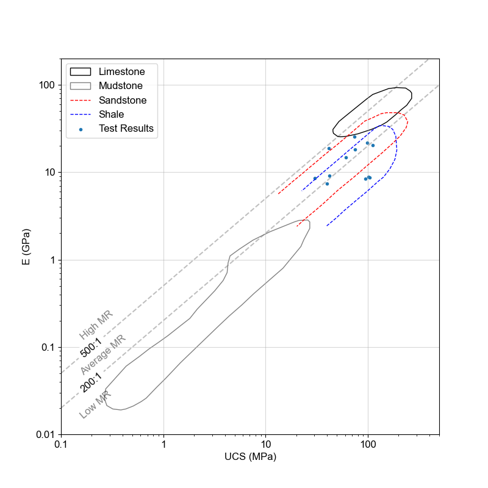

## pyrockmodulus.modulus_ratio()

Loads the digitized Deere_Miller clusters and plots them based on the Major Rock Type *(i.e., Igneous / Metamorphic / Sedimentary)*.
- Plot all Major Rock Type in one graph.
- Plots them individually.

**Deere-Miller [Modulus Ratio] Example**

1. Plot the Modulus Ratio of just the Sedimentary clusters with the ISRM 1979 category classification. 
```python
import pyrockmodulus
import matplotlib.pyplot as plt

xx = pyrockmodulus.modulus_ratio()
xx.initial_processing(plot_all_clusters=False, rock_type_to_plot='Sedimentary', ucs_class_type="ISRMCAT\n1979")
plt.ylabel("E (GPa)")
plt.xlabel("UCS (MPa)")
plt.show()
```


2. Plot the Modulus Ratio with all the categories without the classification. Legend enabled. 

```python
import pyrockmodulus
import matplotlib.pyplot as plt

xx = pyrockmodulus.modulus_ratio()
xx.initial_processing(plot_all_clusters=True)
plt.ylabel("E (GPa)")
plt.xlabel("UCS (MPa)")
plt.legend()
plt.show()
```


3. Plot the Modulus Ratio of just the Sedimentary clusters overlaid with data from tests.

```python
import pyrockmodulus
import matplotlib.pyplot as plt
# Data Set
ucs_data = [75.33, 99.03, 111.69, 30.17, 73.76, 41.69, 42.09, 60.99, 39.65, 94.52, 104.6, 102.03]
E_data = [18.31, 21.85, 20.51, 8.62, 25.72, 18.68, 9.2, 14.67, 7.38, 8.48, 8.7, 8.82]
xx = pyrockmodulus.modulus_ratio()
plotting_axis = xx.initial_processing(rock_type_to_plot='Sedimentary')
# Plot the data on the Deere-Miller axis
plotting_axis.scatter(ucs_data, E_data, label='Test Results', marker='.')
plt.ylabel("E (GPa)")
plt.xlabel("UCS (MPa)")
plt.legend()
plt.show()
```
 

## pyrockmodulus.strength_ratio()

Loads the constructed Tatone et al. UCS:BDS clusters and plots them based on the Major Rock Type *(i.e., Igneous / Metamorphic / Sedimentary)*.
- Plot all Major Rock Type in one graph.
- Plots them individually.

The functionality is similar to that of the modulus ratio. 

```python
import pyrockmodulus
import matplotlib.pyplot as plt

xx = pyrockmodulus.strength_ratio()
xx.initial_processing(plot_all_clusters=False, rock_type_to_plot='Sedimentary')
plt.ylabel("BDS (MPa)")
plt.xlabel("UCS (MPa)")
plt.show()
```


## pyrockmodulus.poisson_density()

Plot the most common ranges of density and poisson's ratio for rock. This data can then be overlaid with data from a specific source to show comparison. 

```python
import matplotlib.pyplot as plt
import pyrockmodulus
xx = pyrockmodulus.poisson_density()
df_data = xx.initial_processing()
ax1 = xx.plot_span_chart(df_data, ['Min_D', 'Max_D'], 'Density', r'$\rho$ g/cm$^{3}$')
ax1.axvline(2.0, lw=1, ls='--')
plt.show()
```


## UCS_Descriptions.py

This file holds the dictionaries for the various UCS classification systems available. References for those systems are within the file. All values **must** be in **MPa**.
Avaliable classificatin systems 'ISRM\n1977', 'ISRMCAT\n1979', 'Bieniawski\n1974', 'Jennings\n1973', 'Broch & Franklin\n1972', 'Geological Society\n1970', 'Deere & Miller\n1966', 'Coates\n1964', 'Coates & Parsons\n1966', 'ISO 14689\n2017', 'Anon\n1977', 'Anon\n1979', 'Ramamurthy\n2004'

**UCS Classification System Examples** 

1. Display the limits and the classification system default in the script. 
```python
import pyrockmodulus.rock_variables as ucs_class
ucs_class.ucs_strength_criteria('ISRMCAT\n1979')
```
Output
```
(['R0', 'R1', 'R2', 'R3', 'R4', 'R5', 'R6'], [0.25, 1, 5, 25, 50, 100, 250, 1000])
```

2. A horizontal bar like plot to show the various uniaxial strength classification systems.

```python
import pyrockmodulus.ucs_bar_chart_plot as ucs_classification_plot
import matplotlib.pyplot as plt

ucs_class = ucs_classification_plot.initial_processing()
plt.show()
```


