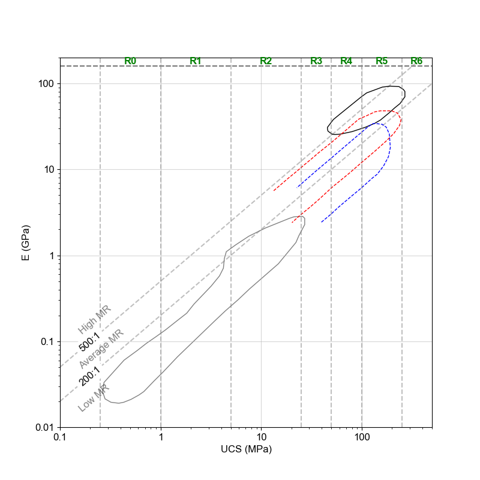
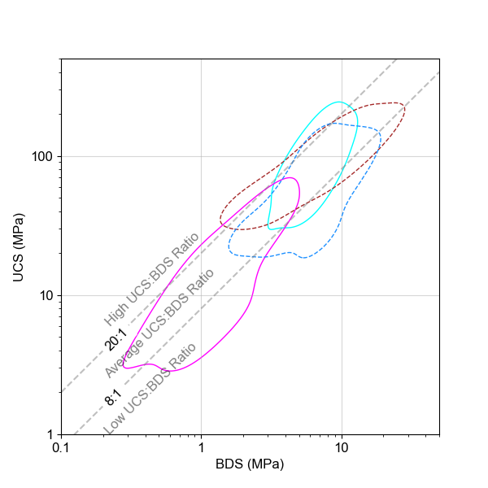
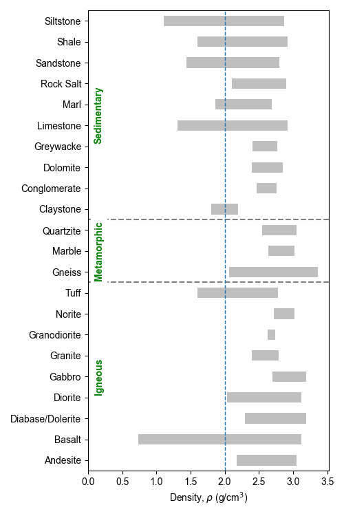

The package herein helps visualise the relationship between the uniaxial compressive strength (UCS), Young's Modulus (E), and the in-direct tensile strength, commonly known as the Brazilian Disc (BD). The Modulus Ratio (MR) [[1]](#1) is the correlation between the UCS and E while the Strength Ratio (SR) [[2]](#2) is the correlation between the BD and UCS.

## pyrockmodulus.modulus_ratio()

Loads the digitized Deere_Miller clusters and plots them based on the major rock type *(i.e., Igneous / Metamorphic / Sedimentary)*. Two options are available to plot his information: 
- Individually.
- All major rock types in one figure.

**Modulus Ratio [[1]](#1) Example**

1. Plot the MR of just the Sedimentary clusters with the ISRM 1979 [[3]](#3) category classification.
```python
import pyrockmodulus
import matplotlib.pyplot as plt

mr_mod_plot = pyrockmodulus.modulus_ratio()
mr_mod_plot.initial_processing(plot_all_clusters=False, rock_type_to_plot='Sedimentary', ucs_class_type="ISRMCAT\n1979")
plt.ylabel("E (GPa)")
plt.xlabel("UCS (MPa)")
plt.show()
```


2. Plot the MR with all the categories without the classification. Legend enabled. 

```python
import pyrockmodulus
import matplotlib.pyplot as plt

mr_mod_plot = pyrockmodulus.modulus_ratio()
mr_mod_plot.initial_processing(plot_all_clusters=True)
plt.ylabel("E (GPa)")
plt.xlabel("UCS (MPa)")
plt.legend()
plt.show()
```


3. Plot the MR of just the Sedimentary clusters overlaid with data from tests.

```python
import pyrockmodulus
import matplotlib.pyplot as plt
# Data Set
ucs_data = [75.33, 99.03, 111.69, 30.17, 73.76, 41.69, 42.09, 60.99, 39.65, 94.52, 104.6, 102.03]
E_data = [18.31, 21.85, 20.51, 8.62, 25.72, 18.68, 9.2, 14.67, 7.38, 8.48, 8.7, 8.82]
mr_mod_plot = pyrockmodulus.modulus_ratio()
mr_mod_axis = mr_mod_plot.initial_processing(rock_type_to_plot='Sedimentary')
# Plot the data on the Deere-Miller axis
mr_mod_axis.scatter(ucs_data, E_data, label='Test Results', marker='.')
plt.ylabel("E (GPa)")
plt.xlabel("UCS (MPa)")
plt.legend()
plt.show()
```
 

## pyrockmodulus.strength_ratio()

Loads the constructed Strength Ratio clusters [[2]](#2) and plots them based on the major rock type *(i.e., Igneous / Metamorphic / Sedimentary)*. Two options are available to plot his information: 
- Individually.
- All major rock types in one figure.

The functionality is similar to that of the modulus ratio. 

```python
import pyrockmodulus
import matplotlib.pyplot as plt

sr_mod_plot = pyrockmodulus.strength_ratio()
sr_mod_plot.initial_processing(plot_all_clusters=False, rock_type_to_plot='Sedimentary')
plt.ylabel("UCS (MPa)")
plt.xlabel("BDS (MPa)")
plt.show()
```


## pyrockmodulus.poisson_density()

Plot the most common ranges of density and poisson's ratio for rock. This data can then be overlaid with data from a specific source to show comparison. 

```python
import matplotlib.pyplot as plt
import pyrockmodulus
poi_den = pyrockmodulus.poisson_density()
df_data = poi_den.initial_processing()
ax1 = poi_den.plot_span_chart(df_data, ['Min_D', 'Max_D'], 'Density', r'$\rho$ g/cm$^{3}$')
ax1.axvline(2.0, lw=1, ls='--')
plt.show()
```



## UCS_Descriptions.py

This file holds the dictionaries for the various UCS classification systems available. References for those systems are within the file. All values **must** be in **MPa**.
Avaliable classificatin systems 'ISRMCAT\n1979' [[3]](#3), 'Bieniawski\n1974' [[4]](#4), 'Jennings\n1973' [[5]](#5), 'Broch & Franklin\n1972' [[6]](#6), 'Geological Society\n1970', 'Deere & Miller\n1966' [[7]](#7), 'Coates\n1964' [[8]](#8), 'Coates & Parsons\n1966' [[9]](#9), 'ISO 14689\n2017' [[10]](#10), 'Anon\n1977' [[11]](#11), 'Anon\n1979' [[12]](#12), 'Ramamurthy\n2004' [[13]](#13)

**UCS Classification System Examples** 

1. Display the limits and the classification system default in the script. 
```python
import pyrockmodulus.rock_variables as ucs_class
ucs_class.ucs_strength_criteria('ISRMCAT\n1979')
```
Output
```
(['R0', 'R1', 'R2', 'R3', 'R4', 'R5', 'R6'], [0.25, 1, 5, 25, 50, 100, 250, 1000])
```

2. A horizontal bar like plot to show the various uniaxial strength classification systems.

```python
import pyrockmodulus.ucs_bar_chart_plot as ucs_classification_plot
import matplotlib.pyplot as plt

ucs_class = ucs_classification_plot.initial_processing()
plt.show()
```


## References
<a id="1">[1]</a> 
Deere D, Miller R (1966) Engineering classification and index properties for intact rock. Tech. Report No AFWL - TR-65-116. Air Force Weapons Lab., Kirtland Air Base, New Mexico.

<a id="2">[2]</a>
Tatone, B.S.A., Abdelaziz, A. & Grasselli, G. Novel Mechanical Classification Method of Rock Based on the Uniaxial Compressive Strength and Brazilian Disc Strength. Rock Mech Rock Eng 55, 2503–2507 (2022). https://doi.org/10.1007/s00603-021-02759-7

<a id="3">[3]</a>
ISRM commission on standardization of laboratory and field tests: "Suggested methods for the quantitative description of discontinuities in rock masses" International Journal of Rock Mechanics and Mining Sciences & Geomechanics Abstracts,Volume 15, Issue 6, 1978, Pages 319-368, ISSN 0148-9062, https://doi.org/10.1016/0148-9062(78)91472-9.

<a id="4">[4]</a>
Bieniawski ZT (1973) Engineering classification of jointed rock masses. The Civil Engineering in Southern Africa 15

<a id="5">[5]</a>
Jennings JE, Brink ABA, Williams AAB (1973) Revised guide to soil profiling for civil engineering purposes in Southern Africa. The Civil Engineering in Southern Africa 15:3–12. https://doi.org/10.1016/0148-9062(74)91296-0

<a id="6">[6]</a>
Broch E, Franklin JA (1972) The point-load strength test. Int. J. Rock Mech. Min. Sci. Geomech. Abstr. 9:669–676. https://doi.org/10.1016/0148-9062(72)90030-7

<a id="7">[7]</a>
Deere & Miller\n1966 = DEERE, D. U. y MILLER, R. P.. Engineering Classification and Index Properties for Intact Rocks. Kirtland Air Force Base, New Mexico: 1966.

<a id="8">[8]</a>
Coates DF (1964) Classification of rocks for rock mechanics. International Journal of Rock Mechanics and Mining Sciences & Geomechanics Abstracts 1:421–429. https://doi.org/10.1016/0148-9062(64)90008-7

<a id="9">[9]</a>
Coates DF, Parsons RC (1966) Experimental criteria for classification of rock substances. International Journal of Rock Mechanics and Mining Sciences & Geomechanics Abstracts 3:181–189. https://doi.org/10.1016/0148-9062(66)90022-2

<a id="10">[10]</a>
ISO 14689:2017 "Geotechnical investigation and testing — Identification, description and classification of rock."

<a id="11">[11]</a>
Anon, Q. "The description of rock masses for engineering purposes." J Eng Geol 10 (1977): 355-388.

<a id="12">[12]</a>
Anon, O. H. "Classification of rocks and soils for engineering geological mapping. Part 1: rock and soil materials.".

<a id="13">[13]</a>
Ramamurthy, T. "A geo-engineering classification for rocks and rock masses." International Journal of Rock Mechanics and Mining Sciences 41.1 (2004): 89-101.